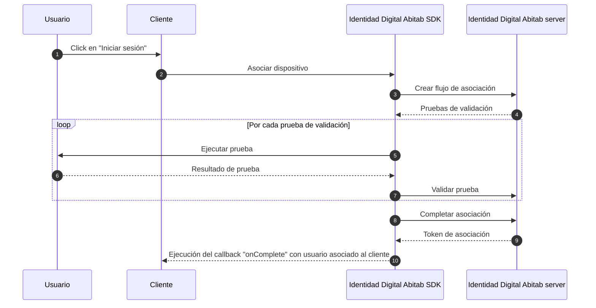

# Flujo de asociación

En el flujo de asociación, el cliente (tu aplicación) solicita al usuario que se autentique en _Identidad Digital Abitab_ para asociar tu aplicación con su identidad. Este flujo es obligatorio antes de poder solicitarle al usuario procesos de autenticación a demanda.

<!-- diagram id="Flujo de asociación" caption: "Flujo de asociación" -->

## 1. Solicitar número de documento

Para poder asociar el dispositivo al usuario debes indicarnos el número de documento, asi como el tipo (CI o PSP) y su país de origen.

## 2. Usuario ejecuta la asociación

Nosotros interactuaremos con el usuario para verificar su identidad y asociar el dispositivo.

## 3. Manejar la respuesta

La respuesta contendra una confirmacion de que el usuario completo el flujo de asociación. Tu deberas confirmar si lo completo de manera correcta o si hubo algún error.

### 3.1 Confirmar si completo con exito

Para confirmar deberas hacer una llamada POST a ...
