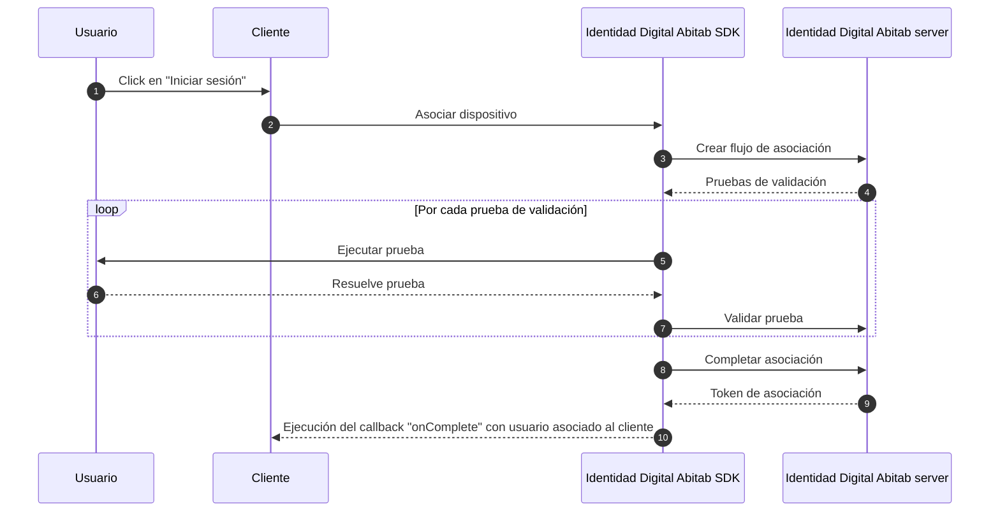

# Flujo de asociación

En el flujo de asociación, el cliente (tu aplicación) solicita al usuario que se autentique en _Identidad Digital Abitab_ para asociar tu aplicación con su identidad. Este flujo es obligatorio antes de poder solicitarle al usuario procesos de autenticación a demanda.


<!-- TODO: Verificar si el cliente pide el numero de documento o si hacemos algo como la pagina intermedia donde lo solicitamos nosotros -->
## 1. Solicitar asociación
Deberas asociar al usuario a tu aplicación cuando sea necesario, por ejemplo cuando el usuario haga click en el botón de "Iniciar Sesión". Para hacer esto, Ejecuta nuestra función de _Asociación de dispositivo_. Asegúrate de incluir los siguientes parámetros en la ejecución:
- `document`: El documento del usuario, compuesto por:
  - `number`: El número del documento.
  - `type`(opcional): El tipo del documento (CI o PSP, siendo CI el defecto).
  <!-- TODO: Como se indica el pais de emision? -->
  - `country`(opcional): El pais de emisión del documento (siendo UY por defecto).
- `onComplete`: Función que será ejecutada una vez que el usuario complete con éxito el flujo de asociación.
- `onError`: Función que será ejecutada si el flujo no es completado con éxito.
<!-- TODO: Esto va? -->
- `context`: Contexto de tu aplicación para poder interactuar con el usuario.

<!-- TODO: Incluir codeblocks con la ejecución de associateDevice() -->
<!-- Ejemplo de la ejecución:
::: code-group
```kotlin
```
```swift
```
```typescript
```
::: -->

## 2. Manejar la respuesta de la asociación
Después de que el usuario se autentica, Identidad Digital Abitab SDK redirigirá al usuario de vuelta a tu aplicación haciendo uso de la ejecución de la funcion `onComplete` creada por ti. Si esta función es ejecutada quiere decir que el usuario pudo identificarse correctamente en nuestro sistema y tu aplicación esta asociada a su identidad.

## 3. Manejar errores
Durante el proceso de asociación, pueden surgir errores. Por ejemplo, el usuario puede cancelar la autorización o puede ocurrir un error interno. Identidad Digital Abitab informará a tu aplicación sobre estos errores a través de la función `onError` creada por ti, tu aplicación deberá manejar estos errores y mostrar un mensaje adecuado para el usuario utilizando los parámetros:
- `IDDigitalError` compuesto por:
  - `message`: Proporciona una descripción del error.
  - `cause`: Identifica el tipo de error.