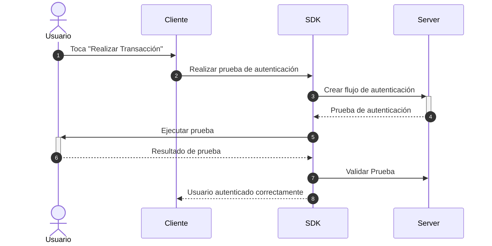

# Flujo de asociación

En este flujo, el cliente (tu aplicación) solicita al usuario que se autentique en _Identidad Digital Abitab_ para verificar su identidad. Este flujo puede realizarse a demanda y ejecutando el método de validación que se considere necesario.  
Actualmente los métodos de validación disponibles son `PIN` y `Liveness`.

## 1. Solicitar autenticación
Podrás solicitar una autenticación al usuario cuando consideres necesario, por ejemplo cuando el usuario haga click en el botón "Realizar transacción". Para hacer esto, tendras disponible una función por cada metodo de autenticación. 
Asegúrate de incluir los siguientes parámetros en la ejecución:
- `document`: El documento del usuario, compuesto por:
  - `number`: El número del documento.
  - `type`(opcional): El tipo del documento (CI o PSP, siendo CI el defecto).
  <!-- TODO: Como se indica el pais de emision? -->
  - `country`(opcional): El pais de emisión del documento (siendo UY por defecto).
- `onComplete`: Función que será ejecutada una vez que el usuario complete con éxito el flujo de autenticación.
- `onError`: Función que será ejecutada si el flujo no es completado con éxito.

## 2. Manejar la respuesta de la autenticación
Después de que el usuario se autentica, Identidad Digital Abitab SDK redirigirá al usuario de vuelta a tu aplicación haciendo uso de la ejecución de la funcion `onComplete` creada por ti. Si esta función es ejecutada quiere decir que el usuario completo el proceso con éxito y pudimos autenticar su identidad.

## 3. Manejar errores
Durante el proceso de autenticación, pueden surgir errores. Por ejemplo, el usuario puede cancelar el proceso o puede ocurrir un error interno. Identidad Digital Abitab informará a tu aplicación sobre estos errores a través de la función `onError` creada por ti, tu aplicación deberá manejar estos errores y mostrar un mensaje adecuado para el usuario utilizando los parámetros:
- `IDDigitalError` compuesto por:
  - `message`: Proporciona una descripción del error.
  - `cause`: Identifica el tipo de error.